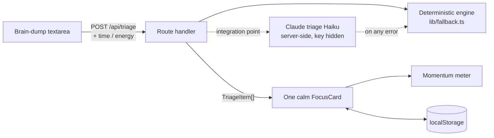

# Unstuck

**Dump everything on your mind. Get one calm next step you can actually do right now.**

Overwhelm doesn't make us lazy — it freezes us. Up to **80–95% of students procrastinate, and 15–20% of adults are chronic procrastinators** ([Steel, 2007, *Psychological Bulletin*](https://psycnet.apa.org/record/2006-23058-004) — a meta-analysis of 691 studies). The usual "fix" — a longer to-do list — makes it worse: you stare at twelve things and start none.

Unstuck flips that. You brain-dump the mess, and it hands you **the single smallest physical next action**, matched to the time and energy you have this minute — one card at a time, with a momentum meter that fills as you go. Built for **Design4Future**: it helps people *take action and stay in control of their day*, one tiny win at a time.

## What it does

1. **Brain-dump** — type everything swirling in your head. Messy is fine.
2. **Triage** — each thing is shrunk to a 2-to-5-minute *first step*, not the whole scary task.
3. **One card at a time** — Unstuck surfaces the most unblocking action that fits your current time + energy. Set "5 min · low energy" and it swaps in something you can actually face.
4. **Momentum** — mark it done, the meter fills, the next card appears. Small wins compound.

No account. No setup wall. Your session lives in your browser.

## The one idea that makes it different

Plenty of tools organize a list or break a task down. Unstuck's core move is **matching the next action to the state you're in right now** — the right *small* thing for the energy you actually have — wrapped in a calm, single-focus interface designed to lower anxiety instead of adding to it.

## How it works



- **`POST /api/triage`** takes your dump plus current time/energy and returns ranked `TriageItem`s (validated with zod).
- Today triage runs on a **deterministic decomposition engine** (`lib/fallback.ts`), so the app needs **no API keys and works fully offline**. That same endpoint is the drop-in point for **Claude-powered triage (Haiku)** behind the identical response contract; on any AI error it falls back to the deterministic engine, so the experience never breaks.
- When configured, the Claude key is read **server-side only** (`process.env.ANTHROPIC_API_KEY`) and never reaches the browser.
- State persists in `localStorage` (`unstuck:session:v1`). No backend, no accounts, no PII.

See [`../docs/CONTRACT.md`](../docs/CONTRACT.md) for the full interface and [`../docs/SPEC.md`](../docs/SPEC.md) for scope.

## Tech

Next.js 16 (App Router) · React 19 · TypeScript · Tailwind v4 · deployed on Vercel.

## Run it locally

```bash
cd unstuck
npm install
npm run dev      # http://localhost:3000
```

No environment variables required — it runs entirely on the offline engine.

## Design

**"Warm paper, calm focus"** — a soft ivory canvas, one confident clay accent, editorial serif headings ([Newsreader](https://fonts.google.com/specimen/Newsreader)) paired with a clean sans (Geist), and motion only where it clarifies. Deliberately not dark, not a templated dashboard. Respects `prefers-reduced-motion`; the judged screens are clean at 320 / 768 / 1024 / 1440.

## Scope (on purpose)

- **In:** brain-dump → one-action → momentum loop, time/energy calibration, offline fallback, persistence.
- **Out (deliberately):** accounts, calendar/email sync, mobile app, collaboration, notifications, settings sprawl. One screen, one loop, done well.

## Roadmap

- **Claude-powered triage (Haiku)** for sharper, more human decomposition — *in progress*.
- A gentle daily "what's the one thing?" entry point.
- Optional export of the steps you completed today.
