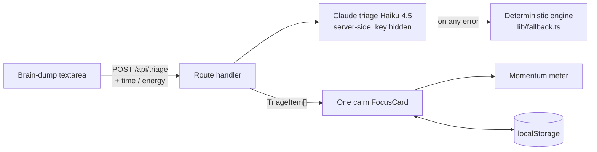

# Unstuck

**Dump everything on your mind. Get one small step you can actually take right now.**

**Live:** https://unstuck-theta.vercel.app

Overwhelm doesn't make us lazy. It freezes us. Up to 80% to 95% of students procrastinate, and 15% to 20% of adults are chronic procrastinators ([Steel, 2007, *Psychological Bulletin*](https://psycnet.apa.org/record/2006-23058-004), a meta-analysis of 691 studies). The usual fix, a longer to-do list, makes it worse. You stare at twelve things and start none.

Unstuck turns that pile into one small step. You write down whatever is in your head, and it hands back the single smallest physical next action, matched to the time and energy you have this minute. One calm card at a time, with a momentum meter that fills as you go. Built for Design4Future, it helps people take action and stay in control of their day.

## What it does

1. **Brain dump.** Write everything swirling in your head. Messy is fine.
2. **Triage.** Each thing becomes a 2-to-5-minute first step, not the whole task.
3. **One card at a time.** Unstuck shows the most unblocking action that fits your current time and energy, and tells you why it fits. Set "5 min, low energy" and it swaps in something you can actually face.
4. **Momentum.** Mark it done, the meter fills, the next card appears.

No account. No setup wall. Your session lives in your browser.

## The idea that makes it different

Unstuck is an anti-freeze engine. The AI breaks each worry into its smallest next step and tags it with the time and energy it needs. Unstuck then instantly surfaces the one that fits the state you are in, and tells you why it is the right one right now. The AI handles the decomposition and tagging. The app handles the instant surfacing, the match to your energy and time, and the plain-language reason for the pick. All of it inside a calm interface built to lower anxiety instead of adding to it.

## How it works



- `POST /api/triage` takes your dump plus current time and energy, and returns ranked `TriageItem`s, validated with zod.
- Triage runs on Claude (Haiku 4.5) server-side, rate limited, using forced tool use so the JSON is always well formed. With no key, or on any error, it falls back to a deterministic engine (`lib/fallback.ts`), so the app works even offline.
- The Claude key is read server-side only and never reaches the browser. The triage endpoint is rate limited, and because the model is constrained to a single tool schema, a brain dump can only ever produce a triage list. A prompt-injection attempt inside the dump cannot exfiltrate anything or change what the server does.
- If a dump shows signs of crisis or self-harm, Unstuck sets the tasks aside and offers calm support resources (988 and Crisis Text Line) instead of turning a crisis into a task.
- State lives in `localStorage`. No backend, no accounts, no personal data stored.

See [`../docs/CONTRACT.md`](../docs/CONTRACT.md) for the full interface and [`../docs/SPEC.md`](../docs/SPEC.md) for scope.

## Tech

Next.js 16 (App Router), React 19, TypeScript, Tailwind v4. Deployed on Vercel.

## Run it locally

```bash
cd unstuck
npm install
npm run dev      # http://localhost:3000
```

It runs without any keys on the deterministic engine. To use Claude, copy `.env.example` to `.env.local` and add an `ANTHROPIC_API_KEY`.

## Design

"Warm paper, calm focus." A soft ivory canvas, one clay accent used sparingly, an editorial serif (Newsreader) paired with a clean sans (Geist), and motion only where it helps. Not dark, not a templated dashboard. It respects `prefers-reduced-motion` and stays clean from 320 to 1440 px.

## Scope, on purpose

In: the brain-dump to one-action to momentum loop, time and energy calibration, the offline fallback, and persistence.

Out, deliberately: accounts, calendar or email sync, a mobile app, collaboration, notifications. One screen, one loop, done well.

## Roadmap

A daily "what's the one thing?" entry point, and an optional export of the steps you finished.
